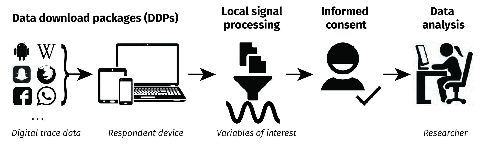

# Summary

*A summary describing the high-level functionality and purpose of the software for a diverse, non-specialist audience.*

Recently, a new workflow was introduced that allows research participants to donate their digital trace data for research [@boeschoten2022framework]. In this workflow, the digital traces of participants are processed locally on their own devices in such a way that only those features are shared that are of interest to the researcher. 

This *data donation workflow* consists of the following steps: First the participant requests a digital copy of their personal data at the platform of interest. Second, they download it onto their personal device. Third, by means of *local processing*, only the features of interest to the researcher are extracted from that DDP. Fourth, the participant inspects the extracted features after which they can consent to donate. Only after providing this consent, the donated data is sent to a server which can be accessed by the researcher for further analyses. 

In this paper, we introduce PORT. PORT is a software tool that allows researchers to configure the local processing step of the data donation workflow, allowing the researcher to collect exactly the digital traces needed to answer their research question. When using PORT, a researcher can decide: 

- Which digital platforms are investigated?
- Which digital traces are collected?
- How are the extracted digital traces visualized?
- What is communicated to the participant?

# Statement of need

*A Statement of need section that clearly illustrates the research purpose of the software and places it in the context of related work.*

In our everyday lives, we leave more and more digital traces behind. Whether we like a post on Instagram, or send a message on WhatsApp. Even when we check-in at public transportation, or when we do a bank transaction we leave behind a digital trace. The promise of digital humanities and computational social science has been that researchers can utilize these digital traces to study human behavior and interaction at an unprecendented level of detail [@king2011ensuring]. 

However, while the amount of digital trace data increases, most are closed off in proprietary archives of commercial corporations, with only a subset being available to a small set of elite researchers at a platform's discretion, through initiatives such as Social Science One [@king2020new]), or through increasingly restricted and opaque APIs [@bruns2019after; @freelon2018computational; @perriam2020digital].

An alternative approach to gain access to digital traces is enabled thanks to the European Union's General Data Protection Regulations (GDPR) right to data access and data portability [@ausloos2019gdpr]. Thanks to this legislation, all data processing entities are required to provide citizens a digital copy of their personal data upon request, which typically come in the form of .zip files to which we refer as *Data Download Packages* (DDPs).

This allows researchers to invite participants to share their DDPs. A major challenge is however that DDPs potentially contain very sensitive data, and often not all data is needed to answer the specific research question under investigation. To circumvent these challenges, @boeschoten2022framework developed an alternative workflow:  First, the research participant requests their personal DDP at the platform of interest. Second, they download it onto their own personal device. Third, by means of local processing, only the features of interest to the researcher are extracted from that DDP. Fourth, the participant inspects the extracted features after which they can consent (or decline) to donate. Only after providing this consent, the donated data is sent to a server which can be accessed by the researcher for further analyses. See \autoref{fig:workflow} for an overview of these steps.

In the last years, researchers have used multiple approaches to deal with the privacy issues related to donation of DDPs. For example, @van2022promises requested participants to share their complete Instagram DDPs, which were immediately de-identified prior to further analyses [@boeschoten2021automatic]. @kmetty2022your requested participants to visit a research site, where they downloaded their DDPs which were then de-identified under the participant's supervision. @araujo2022osd2f developed software that allows for the participants to decide per data instance within a DDP whether they want to delete it prior to donation. @boeschoten2022privacy introduced a proof-of-concept of the software PORT, allowing for local processing of DDPs which results in aggregated, de-identified data. 

In this paper, we introduce a new version of PORT. It is open-source and allows for researchers to fully configure their own data donation study. It creates a website that guides participants through the data donation steps. Researchers can tailor this website to the DDP of their platform of interest and process these in their desired ways. In addition to local processing, key features from OSD2F are also integrated, allowing participants to decide per data instance whether they want to exclude it from being donated. 

# Which digital platforms are investigated?

PORT itself is a platform agnostic tool, so DDPs from any platform can be processed using PORT. However, the procedure for requesting and downloading a DDP is not always straightforward. Therefore, we recommend researchers to carefully investigate this prior to setting up a data donation study, as these steps will be part of the participant's data donation flow.

Furthermore, considering the participant burden, we recommend to minimize the number of digital platforms investigated. Having that said, PORT does support donation from multiple platforms. There are two approaches to prepare a data donation flow for multiple platforms. 

The first option is to prepare multiple separate instances of PORT, each tailored to a specific platform. These result in multiple data donation weblinks that can be presented in the study invitation. The alternative option is to prepare multiple data donation steps in a single instance of PORT. The researcher then decides in which order the platforms are presented, and a skip button can be placed to allow participants to fully skip a platform which they for example do not use or which they do not wish to donate. 

# Which digital traces are collected? 

PORT consists of two distinct elements, which are both fully controlled by a Python script that runs locally in the browser of the participant. This Python script is specifically tailored for each data donation study. The first element is the data donation study flow. This goal of this part of the Python script is to provide explanations or instructions to the participant at various steps of the flow. The second element is the data extraction process. The goal of this part is to make sure that only the digital traces that are of interest to the researcher are extracted from the DDPs.

To run a custom Python script, PORT makes use of Pyodide [@pyodide_2021]. Pyodide is a Python distribution for the browser based on WebAssembly [@WebAssembly]. 

Running the custom Python script using Pyodide in the browser of a participant works as follows: 

* The Python script starts and begins to run synchronously, until: 
  1. The script reaches a Python class resembling a UI element that should be shown on screen, a React component [@React].
  2. The script yields and communicates with the app which UI should be rendered on screen.
  3. The participant interacts with the UI element.
  4. The outcome of the interaction is passed back to the Python script and can be handled accordingly.
* Steps 1 through 4 are repeated until the end of the Python script.

In practice, a Python script for a data donation study typically follows the following steps: 

* The starting screen for the data donation process is shown.
* The participant is asked to submit their DDP.
* The input is validated.
* The digital traces of interest to the researcher are extracted from the DDP.
* The extracted digital traces are placed in a table.
* The table is rendered on screen.
* The participant clicks the `donate' button.
* The closing screen is shown.

The benefit of having a python script running inside the browser is that the researcher has familiar tools to design the extraction process in such a way that the privacy of the participants is preserved as much as possible. For this purpose, the researcher can make use of two important features. First, besides extracting digital traces from the DDP, it is also possible to further process these to better match the research question. Figure 2 shows an example where raw Google Semantic Location History (GSLH) data is locally processed in such a way that only the duration and distance of the various activities tracked by GSLH per month are extracted. 

![The left image shows an example of a WhatsApp chat Data Download Package (DDP). The middle image shows how first only the usernames of the members in this chat were locally extracted. The participant can select their own username from this list. The right side shows how this DDP was processed into a frequency table presenting among other things how often the members react to each other. Here, the participant is identified, the others receive anonymous labels. Note that the output is presented in Dutch \label{fig:whatsapp}](WhatsApp_example.jpg)

Second, a local interaction between the participant and the DDP can be created, as such that the participant can give more meaning to the data. Figure 3 shows an example using a DDP of a WhatsApp group chat. Here, the Python script works in such a way that the names of all people in the chat are extracted first. These are then presented to the research participant as such that they can select their own name. This functionality has for example been used to identify the place of the participant within their WhatsApp network, or to allow to only extract the written messages from the research participant and discard the messages from all other in this group chat. In both examples, this functionality allows to preserve the privacy of the people in the group chat other than the research participant. 

# How are the extracted digital traces visualized?

After data extraction and potential further processing, the data is shown on screen for the participants to review, prior to the actual donation taking place. The data is shown to provide participants insight into what they share exactly, in order for them to provide a `true' informed consent when deciding to donate this data to the researcher. This visualization step also provides the participant with more autonomy over what is shared exactly, as they can select specific data instances and delete them prior to donation (see Figure 3 for an example). providing participants with this option is particularly interesting when working with sensitive types of data, such as raw text messages. Here, custom user interface elements can be defined to allow for other types of interactions, or to present the data in other formats, such as in histograms, if suitable. 

# What is communicated to the participant?

When a researcher invites participants for a data donation study, there are various they should communicate. For example, they should inform their participants about the study and its purpose in a formal consent form, they should provide a privacy policy and probably also want to provide instructions on how to request and download the DDP of interest. To communicate all this information in such a way that it is tailor to a specific data donation study, all text that is prompted on screen can be adjusted. In addition, two languages are currently supported (this can be extended), and there is room to link to external documents, which we have used in multiple studies to refer to the privacy policy and data request and download instructions. At last, PORT allows for researchers to collect paradata on their site visitors, which can be used to monitor if the information is clearly provided. 

# Acknowledgements

This project is funded by PDI-SSH. 

# References
